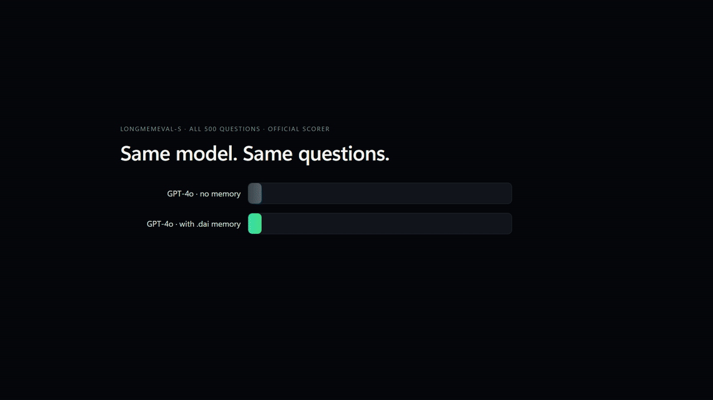
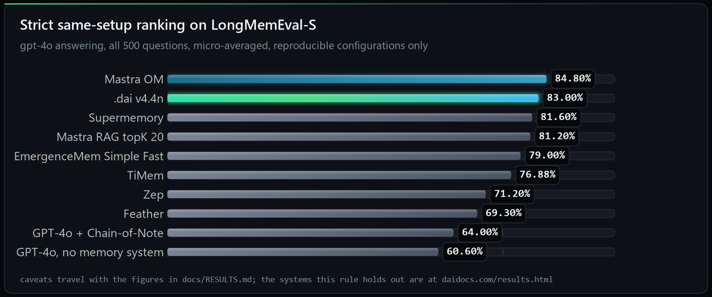
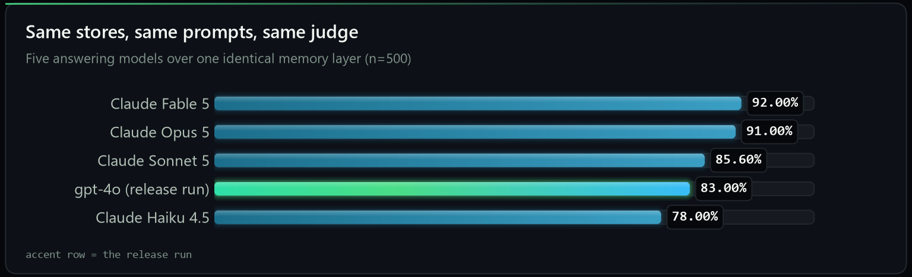
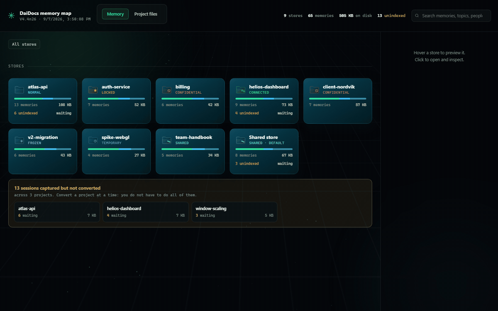
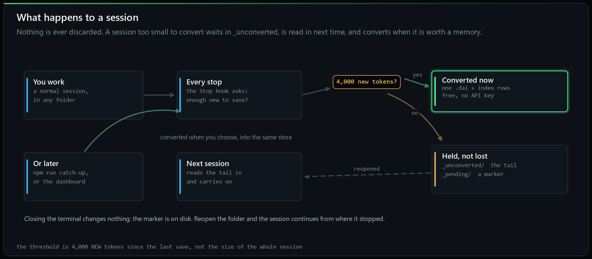
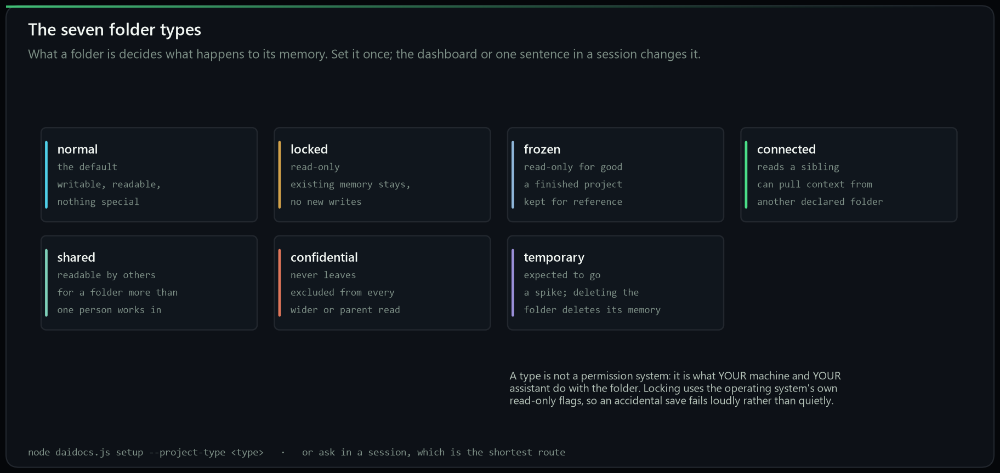
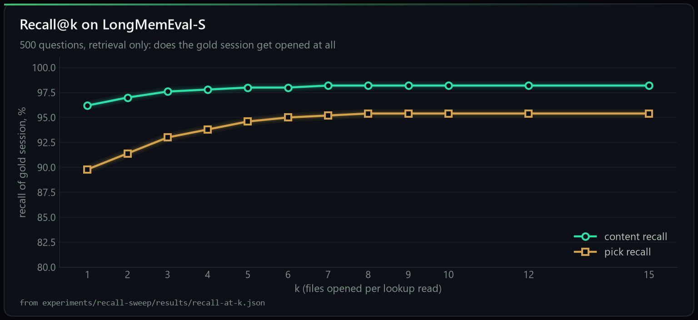

<p align="center">
  <b>English</b> ·
  <a href="README.zh-CN.md">简体中文</a>
</p>

<div align="center">
  

  <h1>.dai</h1>

  <p><b>An open plain-text format for AI memory (launched Sep 2026).</b><br>
  Your assistant's memory becomes files on your disk that you can open, grep and keep.</p>

  <p><b>Second on the LongMemEval-S leaderboard</b> among memory systems anyone can re-run, <b>22.40 points above the same model with no memory</b>, reading <b>10x fewer tokens</b> per question.<br>
  Every number here ships with its per-question judge verdicts and a sha256 manifest.</p>

  <p>
    <a href="QUICKSTART.md"><b>Quickstart</b></a> ·
    <a href="docs/GUIDE.md"><b>The guide</b></a> ·
    <a href="docs/RESULTS.md"><b>Benchmark</b></a> ·
    <a href="spec/DAIDOCS-STANDARD.md"><b>The format</b></a> ·
    <a href="docs/REPLICATION.md"><b>Reproduce it</b></a>
  </p>

  <p><b>Launch release V4.4n32, 12 September 2026.</b> <a href="CHANGELOG.md">What is in it.</a></p>

  <p>
    <a href="https://github.com/Kerneta/daidocs/stargazers"></a>
    <a href="https://discord.gg/DHDtfPx7jw"></a>
    <a href="LICENSE"></a>
    <a href="package.json"></a>
    <a href="docs/INTEGRATION.md"></a>
    <a href="docs/RESULTS.md"></a>
    <a href="RESULTS-ACTORS.md"></a>
    <a href=".github/workflows/ci.yml"></a>
  </p>

  <p><sub>If <code>.dai</code> is useful to you, a <a href="https://github.com/Kerneta/daidocs/stargazers">star</a> helps other people find it.</sub></p>
</div>

<div align="center">
  
  <p><sub><b>The whole product, in one loop.</b> Install, build, remember, recall: one store, every model, about a tenth of the tokens. The recording uses invented data.</sub></p>
  <p><sub><a href="https://daidocs.com/demo.html">&#9654; For higher quality, watch the demo live in your browser</a></sub></p>
</div>

---

## Language independent, model independent

A `.dai` file is three plain-text zones: a YAML header, a fenced JSON block, and the text. No binary, no database, no SDK required to read it.

- **Any programming language.** The reference engine is Node. A reader in Python, Rust or Go is an afternoon's work, and the [spec](spec/DAIDOCS-STANDARD.md) is normative, written so that two independent implementations agree.
- **Any model.** The store is written once by a cheap observer model and read by whichever model answers. The same store measured with five answering models: 78% to 92%. Change the model, keep the memory.
- **Any tool.** `grep`, `git log`, `diff`, your editor, a shell script. Memory that answers to ordinary tools.

Build a reader in another language and open a PR: that is the contribution that matters most.

---

**What is in this repository:** the Kerneta Engine V4.4n that reads and writes `.dai` files,
the MCP server that connects it to your assistants, and the complete evidence for every number
quoted below: the benchmark run, the judge's verdict on each of the 500 questions, and the
five-model comparison. Each evidence file is hashed in [`MANIFEST.sha256`](MANIFEST.sha256)
so you can check that what is described is what was measured; how to do that is in
[`docs/PROVENANCE.md`](docs/PROVENANCE.md).

<div align="center">
  
  <p><sub><b>Second on the leaderboard.</b> One setup for every row: LongMemEval-S, GPT-4o answering, all 500 questions, micro-averaged, and only configurations somebody who does not work for the vendor could re-run. The bottom row is that same GPT-4o with no memory system, reading the whole history pasted into its context: <b>22.40 points below us</b>. Every figure here carries a caveat and the caveat travels with it, in <a href="docs/RESULTS.md">docs/RESULTS.md</a>.</sub></p>
</div>

<p align="center"><b>Not in that table?</b> Graphify, Hindsight, Mem0 and the others publish figures measured on a different answering model, a different denominator or a different benchmark, so they cannot be set beside a GPT-4o 500/500 row in either direction. Every one of them is at <a href="https://daidocs.com/results.html"><b>daidocs.com/results.html</b></a>, with what its number actually measures and where ours sits against it.</p>

<div align="center">
  
  <p><sub>One memory layer, five answering models, 500 questions each. Retrieval identical for every row (proved by a byte-identical diagnostics file). Details and caveats in <a href="RESULTS-ACTORS.md">RESULTS-ACTORS.md</a>.</sub></p>
</div>

---

## Why this exists

Every memory product on the market keeps your history inside its own service and hands it back
through its own API. `.dai` takes the opposite bet: **memory is a file format**, the way a
photo is a JPEG. Three plain-text zones per conversation, a small derived index beside them,
and any model, any tool, or `grep` can read it.

| | memory as a service | memory as a format (`.dai`) |
|---|---|---|
| where your history lives | their database | your disk, plain text |
| who can read it | their SDK | Claude, GPT, Gemini, Cursor, local models, `grep`, `git` |
| when the vendor disappears | so does the memory | the files stay readable in any editor |
| how you inspect a recall | logs, if any | open the file the answer cites |
| what a benchmark number means | one product's pipeline | one store, measured per answering model, so you can pick the model |

The store is built once by a cheap **observer** model and read by any **actor** model. Convert
with a good model, then answer with whatever is cheapest, fastest or local. Numbers below.

---

## Works with

One store, connected over MCP, read and written by the tools you already use. `node setup.js` detects and configures each of these and backs up what it touches; [Install](#install) has the per-tool commands.

| assistants | editors and IDEs | CLI and any MCP client |
|---|---|---|
| Claude Desktop, Claude Code, any model over MCP | Cursor, Windsurf, Zed, Cline, Continue | Codex CLI, plus any MCP client via `--client generic --config <file>` |

**Any MCP-capable runtime, too.** The server is a plain stdio MCP server, so frameworks that speak MCP call `save_memory` and `recall_memory` with no adapter to write: the OpenAI Agents SDK, the Vercel AI SDK, LangGraph, LangChain, CrewAI and LlamaIndex all consume an MCP server as a tool source. Point them at `node mcp_server.mjs`.

**Bring your history.** Claude Code sessions on this machine convert automatically. From any other tool, export a folder of `.txt`, `.md` or `.jsonl` and run `node daidocs.js convert`. Native history import from more tools is on the [roadmap](#contributing).

---

## Install

Node 18 or newer.

```bash
npx daidocs setup
```

One command. It detects Claude Desktop, Claude Code, Cursor, Windsurf, Codex, Cline,
Continue and Zed, configures all of them, installs the session hooks, the reading
protocol and the `.dai` icon, and backs up every file it touches. On a Claude
subscription there is no API key and nothing to pay.

**Want the source and the benchmark artifacts too?** Clone it and run setup from there
instead:

```bash
git clone https://github.com/Kerneta/daidocs daidocs-app
cd daidocs-app
node setup.js
```

The clone is named `daidocs-app` on purpose. `git clone` would otherwise make a folder
called `daidocs`, and the default memory store is `DaiDocs`: on Windows and macOS those
are the same folder, so a clone made from your home directory would land on top of your
own memory. Setup refuses to run from inside the store if it ever happens.

### Python (pip)

Prefer Python? Read your `.dai` stores from code, and drive the engine from a
`daidocs` command:

```bash
pip install daidocs
```

```python
from daidocs import Store

store = Store("~/DaiDocs")          # your memory store
for entry in store.manifest():      # every document
    print(entry["id"], entry["title"])

doc = store.read(store.ids()[0])    # one document, fully parsed
print(doc["understanding"]["summary"])
print(store.search("deploy"))       # find documents by keyword
```

Two things in one install:

- **Reader (pure Python, no Node):** `from daidocs import Store` reads the
  manifest, any document, and the `facts` / `events` / `profile` indexes.
- **`daidocs` command:** drives the Node engine, so `daidocs setup` and
  `daidocs convert` behave like `npx daidocs`. This needs Node 18+; if Node is
  missing it says so and offers to install it. Full guide:
  [`readers/python/`](readers/python/).

`setup.js` installs the dependencies on its first run and then configures everything.
`npm run setup` does the same thing, but `node setup.js` is the one to reach for on
Windows: PowerShell refuses to run npm at all until you change its execution policy,
and node is not affected by that. Each line above is its own command, because Windows
PowerShell 5.1 has no `&&`.

Setup asks nothing. It detects what you have and configures all of it: Claude Desktop,
Claude Code, the session hooks, Cursor, Windsurf, Codex, Cline, Continue, Zed, the reading
protocol and the `.dai` file icon. It backs up every file it touches.

```bash
node setup.js --status     what is on, and the command that changes each one
node setup.js --ask        choose each surface yourself instead
node setup.js --restore    put the machine back exactly as it was
```

The one thing it never does on its own is convert the history you already have, because
that can run for a while and, with an API key, it spends money. It is one command when
you want it, and it is worth wanting: see [Bring what you already have](#bring-what-you-already-have).

**Another MCP client?** One command each, rather than a config to edit:
`node setup.js --client codex` (or `cursor`, `windsurf`, `cline`, `continue`, `zed`), and
`node setup.js --client generic --config <that client's config file>` for anything else.
`node setup.js --client list` shows the names and where each one keeps its config.

In Claude Code every session saves itself as you work, so there is nothing to remember. On any other connected assistant, say **"save this chat to memory"**. To give a folder its own project memory, say **"make this folder a project"** in it, or in a subfolder to make a sub-project.

### Bring what you already have

Most people installing this have months of conversations sitting on disk already. One
command turns them into memory, which is the difference between a store that is useful
this afternoon and one that fills up slowly from here:

```bash
node daidocs.js convert
```

It reads three kinds of history, all the same way:

- **Claude Code sessions on this machine**, from `~/.claude/projects`
- **Sessions already captured but not yet converted**, the `_pending` markers with their
  text in `_unconverted/`
- **A folder of exports** from anywhere else: `.txt`, `.md` or `.jsonl`

It lists what it found with dates, projects and sizes, asks which ones (`all`, or
`1,3,5-8`), asks where the store goes, and **quotes the worst-case token count and cost
before any paid call**. On a Claude subscription that cost is nothing: the assistant in
the session writes the extraction itself. Each item is written the moment it finishes, so
a crash loses at most one document and re-running skips whatever is already converted.
Sessions land in the folder they came from, so a project's history ends up in that
project's own store rather than in one pile.

Every question has a flag, so it scripts:

```bash
node daidocs.js convert --source claude --project atlas-api --pick 1-5 --to ~/DaiDocs --yes
```

[The guide](docs/INTEGRATION.md#converting-existing-history) lists every flag.

### After that it is automatic

You do not have to remember to save anything. Once the hook is installed, every
session saves itself:

- **Every 4,000 new tokens**, the session so far is converted in the background,
  into the folder you are working in. It is written by the assistant already in
  the conversation, so it costs no API key and no extra call.
- **Close the terminal earlier than that** and nothing is lost. After every
  reply the not-yet-converted text is written to `_unconverted/` in the folder's
  store, so even a killed terminal loses at most the last exchange. Open a
  session in that folder again and that text is read in at the start, verbatim,
  and `recall_memory` reads it too, so a 2k session is usable before it is
  converted. What is waiting counts towards the next save, so yesterday's 2k and
  today's 2k convert together, and the folder empties as they do.
- **The first time you open a session in a folder**, you are asked one question
  before anything else: keep this folder's memory here, as a project of its own,
  or in the general store with everything else? Either answer is remembered, so
  you are not asked again for that folder.

So the only thing you do is work. [The guide](docs/GUIDE.md) has the detail, and
the diagram further down shows the whole path.

---

## What you get

A folder. That is the whole trick.

```
~/DaiDocs/
├── 2026-07-12_deploy-debug.dai     one file per conversation, three zones
├── 2026-07-18_q3-planning.dai
├── _index/                         what retrieval reads: manifest, facts, events, profile
├── _unconverted/                   what is not converted yet, small, read by the next session
└── _raw/                           your originals, byte-exact, never deleted
```

There is no database, no memory server and no vendor holding your history. One store serves Claude,
GPT, Gemini, Cursor and local models, and it stays readable when any of them is gone.

Which means your memory answers to ordinary tools:

```console
$ grep -l "Casa do Rio" ~/DaiDocs/*.dai
/home/you/DaiDocs/chat_20260720_e0546121.dai

$ head -12 ~/DaiDocs/chat_20260720_e0546121.dai
---
daidocs: "4.4"
id: "chat_20260720_e0546121"
type: "chat"
title: "Valletta trip planning chat"
lang: "en"
source: {"app": "claude", "native_id": "chat_20260720_e0546121"}
span: null
messages: 3
class: {"category": "general", "priority": "normal", "actionable": false, "sensitivity": "public", "confidence": 0.9}
summary: "User booked a summer trip to Valletta staying at the Casa do Rio guesthouse."
tags: ["x.travel"]
```

No client, no query language, no export step. `git log` your memory if you want to.

### And a map of it, when you want to look

```bash
npm run dashboard
```

<div align="center">
  
  <p><sub>A click-through of the map: every store with its folder type and cost on disk, a store's memories with the lines between related ones, a memory as its own page, and the file in its three zones beside the untouched original. Built from your own files into one self-contained page that works offline. The recording uses invented data.</sub></p>
</div>

**To open it:** in the install folder run `npm run dashboard`. It writes
`daidocs-dashboard.html` beside `package.json` and opens it in your default
browser. One file, offline, no server. Pass `--no-open` if you would rather it
just told you the path.

It is a snapshot, so it shows what was there when it was built. To keep it
current while you work:

```bash
npm run dashboard-live
```

That rebuilds the page whenever a store changes, and the page reloads itself
when you have stopped touching it, landing back in the store you were looking
at. It never reloads mid-read or while you are clicking.

### Nothing is lost when a session is short

<div align="center">
  
</div>

Under 4,000 new tokens a session is not converted yet. Its text is written to
`_unconverted/` in the folder's store, and the next session in that folder
starts with it in front of the assistant, verbatim, so nothing said is lost or
unreadable; `recall_memory` reads it too. Closing the terminal changes nothing:
the text and its marker are files on disk. Convert a backlog whenever you like,
a project at a time, and each one lands in the folder it came from. The moment
one converts, it leaves `_unconverted/`.
[The guide](docs/GUIDE.md) has the detail.

### Memory belongs to the folder it is about

<div align="center">
  
</div>

Declare a folder and its memory lives inside it and travels with it. What the
folder *is* then decides what happens to that memory: a `locked` folder keeps
what it has and accepts nothing new, a `frozen` one is finished, a
`confidential` one is never included in any wider read. Say it in a session, set
it in the map, or pass `--project-type`.

Do not wait to be asked. In a Claude Code session in the folder, type
**make this folder a project**; that is the whole instruction. A project with
several parts, a website, an app, is several projects: **make this folder a
project that reads its parts** at the top, **make this folder a project** in each
part, so a session loads only its part's memory, and **look in the main
project's memory too** when a part needs it; it asks once.
[The guide](docs/GUIDE.md#say-it-in-the-terminal) has it step by step.

---

## Does it work

**83.00%** (415/500) on **LongMemEval-S**: 500 questions over chat histories
averaging 103,601 tokens, measured by the adapter in this repository
([`benchmark/run_longmemeval.mjs`](benchmark/run_longmemeval.mjs)) on stores
built fresh from the dataset, scored by the benchmark authors' own
`evaluate_qa.py` with judge snapshot `gpt-4o-2024-08-06`, GPT-4o answering.
Task-averaged: 84.02%.

[`docs/RESULTS.md`](docs/RESULTS.md) holds the full conditions, the per-category
breakdown including the weakest rows, and the disclosure of everything that was
shaped by developing against this benchmark.

The engine reads a small, question-specific slice of the store instead of the
whole history: **10,065 tokens per question against a 103,601-token history,
about 10.3x fewer**, counted with the same tokenizer on both sides. Retrieval is almost all code
over an index; its one external dependency is a disk-cached
`text-embedding-3-small` call that ranks what the reading model sees (counting
and advice reads make a second call over candidate facts).

**Second on the benchmark**, among memory systems whose configuration can be
reproduced by someone who does not work for the vendor. One system publishes a
higher figure: Mastra Observational Memory at 84.80%, which is 1.80 points and 9
questions ahead on the same GPT-4o actor, a gap inside single-run noise at n=500
(standard error 1.68 points). Against the benchmark authors' own full-context
baseline, the same model reading the pasted history, it is 22.40 points ahead.
The full table, the rule that decides who is in it, and the caveat each figure
carries are in [`docs/RESULTS.md`](docs/RESULTS.md); the figures themselves are
recorded as data with their sources in [`tools/references.json`](tools/references.json).

The engine routes a question to one of four reading strategies (lookup, tally,
timeline, advice) with a regex classifier over the question text. Whether that is
tailored to the benchmark is a fair question with a checkable answer: the
classifier reads the question text only, has no access to the dataset, and no
caller can override it. Print it from the shipped source and measure it yourself:

```bash
node tools/verify_router.mjs /path/to/longmemeval_s.json
```

[What that measurement can and cannot rule out.](docs/RESULTS.md#you-classify-the-questions-isnt-that-gaming-the-benchmark)

### One memory layer, five answering models

The store is portable across models; the score is not. So the same 500 questions were
answered again with everything held fixed (same stores, same rendered prompts, same regex
routing, same judge) and only the answering model swapped:

| actor | accuracy | correct | +/- 1 s.e. | task-averaged |
|---|--:|--:|--:|--:|
| Claude Fable 5 | **92.00%** | 460/500 | 1.21 | 91.94% |
| Claude Opus 5 | **91.00%** | 455/500 | 1.28 | 90.94% |
| Claude Sonnet 5 | **85.60%** | 428/500 | 1.57 | 86.75% |
| `openai:gpt-4o` (release run) | **83.00%** | 415/500 | 1.68 | 84.02% |
| Claude Haiku 4.5 | **78.00%** | 390/500 | 1.85 | 77.66% |
| `openai:gpt-4o`, no memory system | 60.60% | 303/500 | 2.19 | not published |

The last row is the same model with **no memory layer at all**: the benchmark
authors' own full-context baseline, where the entire history is pasted into the
context window and the model answers from that. It is their measurement on
their harness, not a run of ours. Its count and standard error are arithmetic
on that published percentage at n = 500, by the same formula that gives every
other row its s.e.; the task-averaged column is left open because it needs the
six per-type accuracies and they published one overall figure. Read against our
`gpt-4o` row it is the cleanest comparison available, because the actor is
identical and the only variable is the memory: **83.00% against 60.60%, a gap
of 22.40 points**, and it is the row that costs the most to run, since pasting
the history is what a 100,000-token prompt per question means.

Fable 5 and Opus 5 are inside one standard error of each other and should be read as tied.
The whole spread sits in **multi-session synthesis** (88.72% down to 69.92%); retrieval was
identical for every row, proved by a byte-identical per-question diagnostics file. The Claude
rows were produced through the `manual` provider route rather than the API, which is a real
difference and is disclosed in full in [`RESULTS-ACTORS.md`](RESULTS-ACTORS.md).

### Retrieval, measured on its own

A retrieval-only sweep re-reads the same 500 questions at k = 1 to 15 with no model call at
all: **content recall is 96% at k=1 and 98% from k=3 onward**, and nothing above k=5 moves it.
The shipped operating point (k=5, 10,065 tokens) is where the curve is already flat.
Multi-session sits at 99% content recall and 72.18% accuracy with gpt-4o, which is the clearest
evidence that the remaining errors are reading errors, not search errors.

<div align="center">
  
</div>

Full tables, both recall definitions, and the zero-network-call proof are in
[`experiments/recall-sweep/`](experiments/recall-sweep/).

---

## When it earns its place, and when it does not

**Below roughly 20k tokens of history there is not much to save.** You are asking
a few questions and the whole conversation still fits in the window, so the raw
text is what gets used and DaiDocs is not doing much for you. Past that point
the history stops fitting, and the `.dai` store is what keeps the answers
available. The background conversion runs either way, every 4,000 tokens, so by
the time you cross that line the store is already there.

**Agent traces are the one shape it does not handle well.** Tool calls, stack
traces and file dumps look nothing like conversation, and converting them today
produces poor stores. That is a real gap and it is being worked on.

**Want it run for you?** The engine here is the whole engine and always will be,
self-hosted and free under Apache-2.0. If you would rather not operate it, we
host it: conversion, storage and recall as a managed service, same format, same
files, exportable at any time. That is how the work here gets funded. See
[daidocs.com](https://daidocs.com).

---

## Choosing your model

**Setup asks you once, at install, and that choice then applies everywhere.**
Conversion, the hooks, the MCP server and the CLI all use it until you change it.

**On a Claude subscription, in Claude Code: use Opus.** It is what we recommend,
and on a subscription the conversion is written by the assistant already in the
conversation, so there is no API key and nothing extra to pay.

**With an API key: use `openai:gpt-4.1-mini`.** Low cost, high accuracy, and it
is the observer every published number in this repository was measured with.
`gemini:gemini-3.1-pro` is the other good choice.

**Conversion is cheap in tokens.** Converting a session costs roughly what the
session already occupies plus a question or two at that same size. It is not a
second pass over your whole history; it reads what is new, once.

**Go higher if you like, but do not go lower.** The observer's output is baked
into the file permanently, so every future answer is limited by what it captured
the first time. A model that captures 65% of what mattered instead of 96% does
not give you slightly worse recall later: it gives you a store that no longer
contains the answer. The five-model comparison above is the measured version of
that: the same store, the same questions, and a 14-point spread purely from who
is reading.

The answering model is the cheap decision and can change per question. The
observer is the one worth spending on, because you only get to run it once.

---

## Using it

Six tools over MCP: `save_memory`, `recall_memory`, `list_memories`, `read_memory`, `declare_project` and `brief_parent`. You never call them; you ask naturally:

- *"save this chat to memory"*
- *"what did we decide about the deploy pipeline?"*

With the Claude Code hooks installed, every session saves itself as you work, with nothing to remember.

**Reading a store efficiently is a separate step from connecting one**, and it is the step people
skip. Loading whole `.dai` files instead of the three zooms costs an order of magnitude more
tokens for no accuracy gain. `setup.js` installs the protocol into `~/.claude/CLAUDE.md` for you; the same rules
are in [`prompts/READER-PROMPT.txt`](prompts/READER-PROMPT.txt) to paste into any assistant.

```bash
node daidocs.js ingest ./my-chats ./my-store    # convert a folder
npm run check                                    # verify an install, no API key needed
```

| variable | default | what it does |
|---|---|---|
| `DAIDOCS_STORE` | `~/DaiDocs` | where the store lives |
| `DAIDOCS_OBSERVER` | the model you chose at install | overrides that choice for one run |
| `DAIDOCS_DISABLE` | unset | skip the auto-archive hook |
| `DAIDOCS_NO_PING` | unset | refuse the one-time opt-in install ping without being asked |

---

## Reproduce our numbers

You reproduce the number by running it, not by downloading our answer file. Three things, all
public: the **dataset** (LongMemEval-S), the **engine** (`lib/methods/daidocs-v44n`, in this repo),
and the **scorer** (the benchmark authors' own `evaluate_qa.py`). Protocol in
[`docs/REPLICATION.md`](docs/REPLICATION.md).

Per-question outcomes are in [`benchmark/`](benchmark/) so you can find which questions differ
rather than comparing two totals. **If you cannot reproduce a number, that is the most valuable
issue you can open**, and we will say so publicly rather than quietly editing the page.

---

## Repo map

| path | what it is |
|---|---|
| [`QUICKSTART.md`](QUICKSTART.md) | five minutes, nothing assumed |
| [`spec/DAIDOCS-STANDARD.md`](spec/DAIDOCS-STANDARD.md) | the `.dai` format specification |
| [`docs/RESULTS.md`](docs/RESULTS.md) | the conditions, the disclosures, and every number once measured |
| [`docs/REPLICATION.md`](docs/REPLICATION.md) | how to reproduce them |
| [`docs/READ-DAIDOCS.md`](docs/READ-DAIDOCS.md) | the reading protocol, per surface |
| [`docs/INTEGRATION.md`](docs/INTEGRATION.md) | using it with Claude Code: hooks, converting history, keyless saving |
| [`prompts/`](prompts/) | the protocol as a paste-anywhere prompt |
| [`daidocs.js`](daidocs.js) | the CLI: convert, pending, stores, backup, scrub, ingest, ask |
| [`setup.js`](setup.js) | one-command install and configuration |
| [`lib/methods/daidocs-v44n/`](lib/methods/daidocs-v44n/) | the engine, in the configuration this repo ships |
| [`mcp_server.mjs`](mcp_server.mjs) | the MCP server |
| [`session_archiver.mjs`](session_archiver.mjs) | the Claude Code SessionEnd hook |
| [`session_context.mjs`](session_context.mjs) | the SessionStart hook: memory loads at the start of a session |
| [`session_autosave.mjs`](session_autosave.mjs) | the Stop hook: sessions save themselves, with no API key |
| [`verify_surfaces.mjs`](verify_surfaces.mjs) | `npm run verify`: every surface, free and offline |
| [`keyless_check.mjs`](keyless_check.mjs) | proves nothing needs an API key to run |
| [`lock.js`](lock.js) | `npm run lock`: makes this folder read-only |
| [`assets/`](assets/) | the brand marks, the charts, the diagrams and the demo |
| [`benchmark/run_longmemeval.mjs`](benchmark/run_longmemeval.mjs) | the benchmark adapter, so the run is checkable |
| [`benchmark/`](benchmark/) | per-question results |
| [`RESULTS-SUMMARY.md`](RESULTS-SUMMARY.md) | the release run, gpt-4o, in one page |
| [`RESULTS-ACTORS.md`](RESULTS-ACTORS.md) | five answering models over the identical memory layer |
| [`run-artifacts/`](run-artifacts/) | answers, judge verdicts, diagnostics and the run manifest, per actor |
| [`experiments/recall-sweep/`](experiments/recall-sweep/) | recall@k, k = 1 to 15, retrieval only, zero API calls |
| [`MANIFEST.sha256`](MANIFEST.sha256) | sha256 of every file as frozen; [`docs/PROVENANCE.md`](docs/PROVENANCE.md) says how to verify |
| [`docs/GAPS.md`](docs/GAPS.md) | the honest list of what has not been done |
| [`tools/verify_router.mjs`](tools/verify_router.mjs) | prints the router from source and measures it |
| [`tools/check_numbers.mjs`](tools/check_numbers.mjs) | fails CI if any published number drifts from the artifacts |
| [`tools/make_charts.py`](tools/make_charts.py) | regenerates the charts from the numbers |
| [`tools/chart_theme.py`](tools/chart_theme.py) | the daidocs.com chart surface, ported to matplotlib |
| [`tools/make_diagrams.py`](tools/make_diagrams.py) | regenerates the explainer diagrams |
| [`tools/dashboard/`](tools/dashboard/) | `npm run dashboard`: builds the memory map. A built page is never shipped |
| [`docs/GUIDE.md`](docs/GUIDE.md) | every command, tool, script and folder type, in one page |
| [`tools/make_badges.py`](tools/make_badges.py) | the badges at the top, as local files rather than fetched |
| [`CHANGELOG.md`](CHANGELOG.md) | what changed, per release |
| [`SECURITY.md`](SECURITY.md) | how to report something, and what is in scope |
| [`RUNBOOK.md`](RUNBOOK.md) | the release run, step by step |

---

## Contributing

The format is the point, so the most useful contributions are the ones that put
it in more places.

**Integrations.** A store that only one assistant can read is not a format, it
is a database with extra steps. The MCP server covers Claude Desktop, Claude
Code, Cursor and Windsurf. Everything else is open: an extension for another
editor, a plugin for another agent framework, a loader for another runtime, an
adapter for an assistant that speaks something other than MCP. If you are
wiring one up and something in the format fights you, that is a bug in the
format and worth an issue. Two we want by name: an **OpenRouter** provider backend, one key and hundreds of models, which turns bring-your-own-model into a line of config and slots into `lib/providers/` beside `anthropic`, `openai` and `gemini` with the same small contract; and a **Hermes agent** integration, so someone running that stack can point it at a store and have memory work.

**A second implementation.** A reader or writer that is not this code. It is
deliberately small enough to write in an afternoon: UTF-8, a YAML header, a JSON
zone and text. Two independent implementations is the difference between a file
layout and a format.

**Improvements to the memory itself.** Better extraction, better retrieval,
better handling of the shapes that do not work yet. Agent traces are the obvious
one: tool calls and stack traces convert badly today and somebody solving that
would be solving it for everyone. Anything that makes recall more accurate, or
makes a store cheaper to read, is welcome.

**Bugs and rough edges.** Especially on macOS and Linux, which are audited but
much less used than Windows here. If something is confusing rather than broken,
that is still worth reporting: a feature nobody can find is a feature that does
not exist.

Small changes are welcome without asking first. For anything that changes the
format itself, open an issue before writing code, because that is the part other
people's work depends on staying still.

By contributing you agree your work is licensed under Apache-2.0, and you sign
off that you have the right to submit it ([DCO](https://developercertificate.org/)).

---

## Counting installs, opt-in and off by default

DaiDocs is local-first, and the tool sends nothing on its own. There is exactly one
exception, a single install ping, and it is built to keep that promise rather than bend it:

- It is **asked once**, on the first interactive `setup`, and never again.
- The default is **no**: a bare Enter declines, and it never prompts on a non-interactive run.
- A yes sends **one** anonymous request: a random id, the version and a timestamp. Nothing
  that identifies you, your files or your memory.
- `DAIDOCS_NO_PING=1` refuses it outright, without being asked.
- The choice is recorded in `~/.daidocs/install.json`; delete that file to be asked again.

It exists so the project can count how many people install it. If you would rather it did
not exist at all, that one variable turns it off for good.

---

## Licence

The specification, the engine and the MCP server are **Apache-2.0**, including a patent grant.
Commercial use, modification and redistribution are all fine. There is no lagging free edition:
what is published here is what runs.

Built by [Kerneta](https://daidocs.com).
