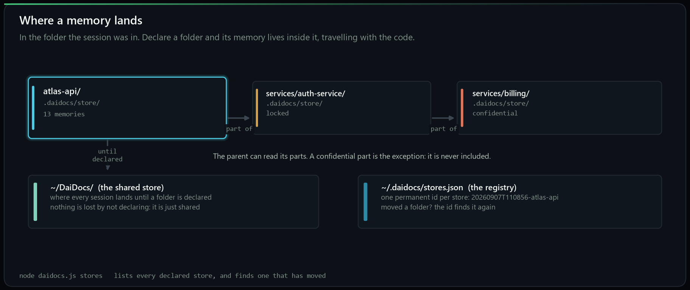
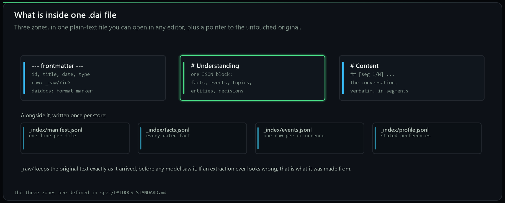
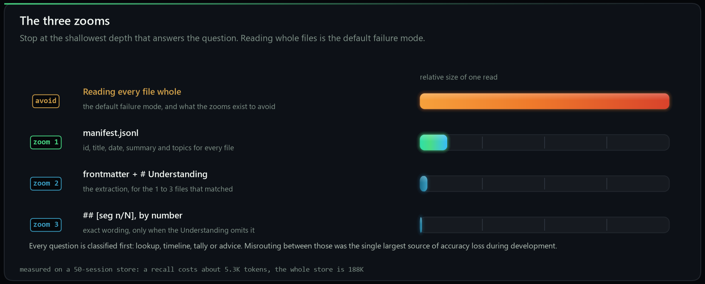

# The complete guide

Everything DaiDocs does, what each part is for, and how to use it. If you only
want to get started, [`QUICKSTART.md`](../QUICKSTART.md) is shorter. This page
is the reference: every command, every tool, every folder type, nothing left out.

- [The shape of it](#the-shape-of-it)
- [What happens to a session](#what-happens-to-a-session)
- [Converting sessions you already have](#converting-sessions-you-already-have)
- [Where a memory lands](#where-a-memory-lands)
- [Folder types](#folder-types)
- [Confidential folders](#confidential-folders)
- [The memory map](#the-memory-map)
- [Backing up and moving](#backing-up-and-moving)
- [Command reference](#command-reference)
- [Tool reference](#tool-reference)
- [Script reference](#script-reference)
- [What is inside a .dai file](#what-is-inside-a-dai-file)
- [Reading well](#reading-well)
- [Choosing your model](#choosing-your-model)
- [Cost](#cost)

---

## The shape of it

DaiDocs turns your assistant's memory into plain files on your own disk. There
are three moving parts and you can ignore two of them most of the time.

| Part | What it is | You touch it |
|---|---|---|
| The **hooks** | Three scripts Claude Code runs on its own: at session start, at every stop, and at session end | Never, after setup |
| The **MCP server** | Six tools your assistant can call to remember and recall | Never directly: you just talk |
| The **CLI** (`daidocs.js`) | Everything else: converting, backing up, listing, checking | Occasionally |

Install once, from inside the clone:

```bash
node setup.js
```

That installs the dependencies on its first run and then configures everything,
asking nothing. (`npm run setup` is the same thing, but on Windows PowerShell will
not run npm until its execution policy is changed, and node is not affected.)
It asks nothing: it finds every
surface you have and configures all of them, backing up each file it touches.
`node setup.js --status` is where you go afterwards. It lists every switch, on or off, with
the command that changes it, which model reads your conversations in, and where your memory
lives. `node setup.js --ask` chooses each one by hand instead, and `--restore` puts the
machine back as it was. Every question
can be answered ahead of time with a flag: see [Script reference](#script-reference).

---

## What happens to a session

<div align="center">
  
</div>

This is the part people worry about, so it is worth being exact.

**Every time the assistant stops**, the Stop hook counts how many *new* tokens
the session has produced since the last save. Not the size of the whole
session: the new part.

**Over 4,000 new tokens**, it converts there and then. One `.dai` file, plus
rows appended to the four index files. This costs nothing and needs no API key,
because the assistant that just read the conversation writes the extraction
itself.

**Under 4,000**, nothing is thrown away, and nothing waits for the threshold.
After every reply the not-yet-converted text is written into `_unconverted/`
in the folder's store, small by construction, with a marker in `_pending/`
recording which project the session came from, which folder, when, and how
much is waiting. The whole transcript is in `_raw/` as well. A killed terminal
loses at most the last exchange.

**And it is read before it is converted.** The next session in that folder
starts with that text in front of the assistant, verbatim, and `recall_memory`
appends it to whatever the index found, so a question about a session that
ended at 2k tokens is answered from it. It is not searchable until converted,
and the moment it is, it leaves `_unconverted/`. Open the folder and what is
there is exactly what is waiting.

**Closing the terminal changes nothing.** The marker is a file on disk. When
you next open a session in that folder, the SessionStart hook reads the marker,
and what was waiting counts towards the next save: a 2k session yesterday and
a 2.5k session today are one memory's worth, and the hook asks for both to be
converted together. You do not have to do anything to make that happen.

**A session that ends for good** still goes through SessionEnd, which archives
whatever is left. Below a 300-token floor it is not worth a file of its own and
stays in `_unconverted` as part of the pending set.

So there are exactly two states a session can be in: converted, or waiting. The
next section is about the waiting ones.

---

## Converting sessions you already have

Anything captured but not yet converted is a backlog, and you can work through
it whenever you like. **Nothing expires.**

Three routes, in order of how little effort they take.

**1. Ask, in a session.** The SessionStart hook tells the assistant how many
are waiting. Say "convert them" and it does, writing the extractions itself. No
API key, no cost.

**2. The memory map.** Open the dashboard and the backlog is grouped by the
project each session came from, with the exact command for each group. You do
not have to do all of them: convert the project you care about and leave the
rest.

```bash
npm run dashboard
```

**3. The command line.**

```bash
node daidocs.js pending
```

lists what is waiting, grouped by project, and

```bash
node daidocs.js pending --route "atlas-api"
```

sends one project's group to the folder it belongs to. If the folder cannot be
found, name it:

```bash
node daidocs.js pending --route "atlas-api" --to "C:/code/atlas-api"
```

**Where do they end up?** In the store belonging to the folder they were
recorded in. A session you had in `~/code/atlas-api` converts into
`~/code/atlas-api/.daidocs/store`, not into some central pile. That is the whole
point: memory stays with the work it is about.

There is also a blunt version that converts everything waiting, wherever it came
from:

```bash
npm run catch-up
```

---

## Where a memory lands

<div align="center">
  
</div>

By default every session lands in one shared store at `~/DaiDocs`. That works,
and for one project it is all you need.

**You are asked once.** The first time a session opens in a folder that has no
store of its own, the assistant asks one question before anything else: keep
this folder's memory here, or in the general store? "Here" declares the folder.
"General" is remembered, so the question is not asked again for that folder,
and you can still declare it later. The home folder is never asked. If the
assistant answers your first message without asking, the Stop hook asks it to
before it finishes, once per session.

**Declare a folder** and it gets a store of its own, inside it:

```bash
node daidocs.js setup --project "atlas-api" --store here
```

or just ask in a session: *"make this folder its own project"*. From then on,
sessions in that folder convert into `atlas-api/.daidocs/store`, and the memory
travels with the folder: copy it to another machine and its memory comes too.

### It happens on its own

You do not have to declare anything. The first time you open a session in a
folder that has no memory of its own, the start hook gives it one: `.daidocs/`
in that folder, and every session there saves into it from that moment. The
assistant mentions it in a line and carries on. Nothing is asked, because there
was a question here and it did not work: an assistant loses to your own first
message, and on a first install the tool the question named does not exist yet.
A hook has neither problem.

Two folders are never claimed: your home folder and a drive root, which are not
projects. Nor is a folder you have already sent to the general store.

**A folder inside a project keeps using that project's memory.** Opening
`atlas-api/src` continues where `atlas-api` left off rather than starting a
third store; splitting a project into parts is a decision you make, not one
that happens by accident (see [One folder per part](#one-folder-per-part)).

To change any of it, say so:

> keep this folder's memory in the general store

and it goes to `~/DaiDocs` with everything else, from then on. Whatever was
already saved in the folder stays exactly where it is, and declaring the folder
again picks it back up. You can also give it a type, "make this folder a
confidential project", or name another location.

### One folder per part

A project with several parts, a website, an app, a data pipeline, is several
projects, and mostly that arranges itself. Working in a folder gives it its own
memory, so folders that sit side by side end up with separate stores without
anyone saying anything:

```
brand/
├── website/          its own memory, made on the first session there
│   ├── .daidocs/
│   └── landing-pages/    a subfolder: keeps using the website's memory
└── product/          its own memory, separate from the site's
    └── .daidocs/
```

That separation is what keeps the session-start index short and a recall cheap:
each part pays only for its own history, and nothing has to memorise the whole
system to work on one corner of it.

**A subfolder is the exception.** A folder inside a declared project carries on
writing into that project's store rather than starting a third one, which is
what stops a repository sprouting a store in every directory. When you want one
to stand on its own, say it in a session there: **make this folder its own
project**. What was already saved stays where it is.

**Reach is something you ask for, one direction at a time.** Each of these is a
sentence said in a session in the folder it is about:

| What you say | What it does |
|---|---|
| **let this folder read the main project too** | `reads: ["self", "parent"]`: answer from here, and fall back to the folder above |
| **let this folder read its parts** | `reads: ["self", "children"]`: the top reads every declared folder one level down, and a part added later is picked up without changing anything |
| **let this folder read ../website** | `reads: ["self", "../website"]`: one side reads the other by name |
| **make this folder confidential** | never included in any wider read, by a parent or anything else |

Nothing widens on its own. A recall reads the folder you are in and stops
there; if that folder has nothing saved yet it names what else it could reach
and asks. The first time it reaches another store it asks once and remembers
the answer, and every answer names the stores it read. Reach is one-way unless
you set it at both ends.

**Parts of a project.** A folder inside a declared folder can be declared too.
The parent reads its parts, so asking a question at the top of `atlas-api` can
draw on `services/auth-service` as well. The one exception is a confidential
part, which is never included.

**Moved the folder?** Every store has a permanent id, stamped with the moment it
was created: `20260907T110856-atlas-api`. The registry at `~/.daidocs/stores.json`
maps ids to locations, so when a folder moves the id still identifies it.

```bash
node daidocs.js stores                    # everything declared, and what is missing
node daidocs.js stores --scan "D:/code"   # find a store that moved, by its id
node daidocs.js stores --forget <id>      # a store that is genuinely gone
```

**Deleting a folder deletes its memory**, permanently, along with everything
else in it. That is the trade for memory that lives with the work. Back it up
first if it matters: see [Backing up and moving](#backing-up-and-moving).

---

## Folder types

<div align="center">
  
</div>

What a folder *is* decides what happens to its memory. There are seven types.

| Type | What it does | When to use it |
|---|---|---|
| `normal` | Writable and readable. The default. | Almost always |
| `locked` | Existing memory stays and can be read; nothing new is written | A project you are not working on this month |
| `frozen` | Read-only, and meant to stay that way | A finished project kept for reference |
| `connected` | Can read another declared folder as well as itself | Two repos that are really one system |
| `shared` | Marked as readable by others | A folder more than one person works in |
| `confidential` | Never included in any wider read | A client's folder, anything under NDA |
| `temporary` | Expected to be deleted; its memory goes with it | A spike, an experiment |

Three ways to set one.

**Ask in a session**, which is the shortest route:

> make this folder confidential

**From the dashboard**, on the folder's page, which shows the current type and
what each one would change.

**From a terminal:**

```bash
node daidocs.js setup --project-type locked
node daidocs.js setup --project-type confidential
node daidocs.js setup --project-type normal      # unlock it again
```

### What locking actually does

A type is not a permission system and does not pretend to be one. It is what
*your* machine and *your* assistant do with the folder.

`locked` and `frozen` use the operating system's own read-only flags: `attrib +R`
plus a deny rule on Windows, the file mode on macOS and Linux. The effect is
that an accidental save fails **loudly** rather than quietly succeeding. That is
the point. A memory store that silently accepts a write you did not intend is
worse than one that refuses.

To lock the whole release folder rather than one store, there is a separate
command:

```bash
npm run lock          # every file read-only, no new files, no deletions
npm run lock-status   # what state it is in
npm run unlock        # when you genuinely mean to change it
```

---

## Confidential folders

A confidential folder is the one type worth explaining on its own, because it
is the only one that changes what a *read* can see rather than what a write can
do.

When a folder is confidential:

- its memory is **never** included in a read scoped wider than itself
- a parent project reading its parts **skips it**
- a connected folder cannot reach into it
- asking a question inside that folder still works normally

Use it for a client's work, for anything under an NDA, and for the folder where
the answers would embarrass you if they surfaced while you were screen-sharing a
different project.

```bash
node daidocs.js setup --project-type confidential
```

Two things it is not. It is **not encryption**: the files are plain text on your
disk, readable by anything with access to that disk, which is true of every
`.dai` file and is the format's whole premise. And it is **not a secret scanner**:
if a credential went into the conversation it is in the store. For that:

```bash
node daidocs.js scrub                  # what credentials are already in a store
node daidocs.js scrub --apply          # rewrite them out
```

Run `scrub` before you share a store with anyone, and before you put a folder
containing one into a repository.

---

## The memory map

<div align="center">
  
</div>

```bash
npm run dashboard
```

builds it. Step by step:

1. Open a terminal in the DaiDocs install folder, the one holding `package.json`.
2. Run `npm run dashboard`.
3. It writes `daidocs-dashboard.html` beside `package.json` and opens it in your
   default browser.

It is one file, it works offline, and it does not phone anywhere. From any other
folder, `node <install>/tools/dashboard/build_dashboard.mjs` does the same. It
is a snapshot: rebuild it to refresh.

It opens the page only when someone is there to see it: an attached terminal.
Piped output, `CI`, `--no-open` and `DAIDOCS_NO_OPEN` each stop it, so a build
inside a script never puts a window on a machine nobody is at.
`DAIDOCS_OPEN_CMD` names a specific program instead of the platform default.

### Keeping it current

```bash
npm run dashboard-live
```

rebuilds the page whenever a store changes, and the page reloads itself to
match. Three things make that unobtrusive rather than annoying:

- **It lands where you were.** The open store, the open memory, the search box
  and the scroll position all survive a reload, so you come back to the same
  screen with new material in it.
- **It waits until you stop.** Twelve seconds without a click, a key or a
  scroll, and never while a memory is open in the reader or the tab is hidden.
- **It is off otherwise.** A page built without `--watch` never reloads itself,
  because without a watcher there would be nothing new to show.

A plain `npm run dashboard` build is still a snapshot: rebuild it to refresh.
The page also asks the browser not to cache it, which is what made a rebuild
sometimes appear to do nothing.

What is in it:

- **Every store you have**, with what each one costs on disk, split between the
  `.dai` files, the index and the raw originals
- **The conversion backlog**, grouped by the project it came from, with the
  command for each group
- **Inside a store**: every memory as a card, with lines drawn between memories
  that share topics or people. Hover one and its connections light up
- **A memory as its own page**: date, title and id at the top, the summary,
  topics, entities and tags, what it is connected to and on which shared terms
- **The file itself**, in the three zones the format defines, plus the verbatim
  original from `_raw` so you can check any extraction against what it was made from
- **Search**, across titles, summaries, topics and entities
- **The folder page**: the real file tree on disk with sizes and per-type counts,
  the commands to open or back it up, and the folder type with every alternative
- **Project files**, the other tab: your projects as they actually are on disk,
  not as memory

The page is a snapshot. It does not update itself; rebuilding is the refresh.

**A built page contains your memories in full, including the verbatim
transcripts and the absolute paths on your machine.** That is what makes it
useful and it is why the repository ships the builder and never a built page.
Treat one you have built the way you would treat the store itself.

---

## Backing up and moving

```bash
node daidocs.js backup "C:/code/atlas-api" --to "D:/backups"
```

copies the project to a dated folder under the destination, skipping
`node_modules` and `.git`. Two useful variants:

```bash
... --to "D:/backups" --zip           # one zip file instead of a folder tree
... --to "D:/backups" --memory-only   # just .daidocs, when the code travels by git
```

`--memory-only` is the one to reach for when the code is already in a repository
and the memory is not. It is small, and it is the half that is not backed up
anywhere else.

To move a project to another machine: copy the folder, then on the far side run
`node daidocs.js stores --scan <folder>` so the registry learns where it went.

---

## Command reference

Every command `daidocs.js` accepts.

| Command | What it does |
|---|---|
| `convert` | Pick chat history and convert it. Interactive by default. `--source claude\|raw\|<folder>`, `--pick all\|1,3,5-8`, `--to <store>`, `--project <name>`, `--min-kb 20`, `--observer <spec>`, `--yes` |
| `pending` | What is captured but not converted, grouped by project. `--route <project>` sends a group home, `--to <folder>` says where home is |
| `stores` | Every declared store, and any that have gone missing. `--scan <folder>` finds a moved one by its id, `--forget <id>` drops one that is gone |
| `backup <folder>` | Copy a project somewhere else. `--to <destination>`, `--zip`, `--memory-only` |
| `scrub [store]` | Find credentials already sitting in a store. `--apply` rewrites them out |
| `ingest <folder> [store]` | Convert a folder of documents into a store. `--observer <provider:model>`, `--force` re-ingests what is already there |
| `ask [store] "question"` | Answer a question from a store, on the command line. `--actor <provider:model>` chooses who answers |

`ingest` and `ask` are the two that call a model directly, so they are the two
that can cost money. Everything else is local. When `DAIDOCS_STORE` is set the
store argument can be left off, which is how the hooks and the MCP server find
it.

Set up and configuration go through `setup.js`:

| Flag | What it does |
|---|---|
| `--all` | Everything, no questions |
| `--desktop` / `--code` | Configure Claude Desktop / Claude Code |
| `--hook` | Auto-archive every Claude Code session |
| `--context` | Load your memory index at session start |
| `--autosave` | Save each session as you work, using this assistant and no API key |
| `--icon` | Register the `.dai` file icon |
| `--instructions` | Write the reading instructions into your assistant's config |
| `--observer <spec>` | Choose the model that reads documents into the index |
| `--project <name>` | Declare the current folder as a project |
| `--project-type <type>` | Set the folder type: one of the seven above |
| `--store here\|shared` | Whether this project keeps its own store |
| `--clients` | List the assistants found on this machine |
| `--versions` / `--version` | What is installed |
| `--restore` | Put back a configuration this changed |
| `--unregister` | Remove what was installed |

---

## Tool reference

The six tools your assistant gets over MCP. You never call these yourself: you
talk, and the assistant calls them. They are listed so you know what it can do.

| Tool | What it does |
|---|---|
| `recall_memory` | Answers from your store using the three-zoom read. Returns assembled context to the assistant already talking to you, so there is no second model call and no double cost |
| `save_memory` | Converts one conversation or document into one `.dai` plus index rows. The assistant writes the extraction itself, so this is free and needs no key |
| `list_memories` | Everything in the store: id, date, title, one-line summary |
| `read_memory` | One file in full, when the summary is not enough |
| `declare_project` | Makes the current folder a project, with a type, its own store, and what it may read (`reads`). This is what answers "make this folder confidential" |
| `brief_parent` | Hands a summary up from a part of a project to the project itself |

---

## Script reference

| Script | What it does |
|---|---|
| `npm run setup` | Install and configure everything, asking nothing. `--ask` to choose |
| `node setup.js --status` | Settings: every switch, its state, and the command that changes it |
| `node setup.js --client <name>` | Configure one MCP client: `codex`, `cursor`, `windsurf`, `cline`, `continue`, `zed`, or `generic --config <file>` |
| `npm run dashboard` | Build the memory map as one HTML file |
| `npm run catch-up` | Convert everything waiting, wherever it came from |
| `npm run server` | Run the MCP server in the foreground. For debugging |
| `npm run selftest` | Check the MCP server answers correctly |
| `npm run verify` | The full offline suite. No API key, no network |
| `npm run check` | The keyless checks plus the unit tests |
| `npm test` | The unit tests alone |
| `npm run numbers` | Check every published figure still agrees with the run artifacts |
| `npm run charts` | Regenerate the benchmark charts |
| `npm run diagrams` | Regenerate the explainer diagrams on this page |
| `npm run badges` | Regenerate the README badges as local SVG files |
| `npm run lock` | Make the whole folder read-only |
| `npm run unlock` | Undo that |
| `npm run lock-status` | Which state it is in |

---

## What is inside a .dai file

<div align="center">
  
</div>

One file per conversation, in three zones, all of it plain text you can open in
any editor. Alongside them, four index files per store, `_raw/` holding the
original text exactly as it arrived before any model saw it, and `_unconverted/`
holding what is not converted yet, which the next session reads.

The full definition is in [`../spec/DAIDOCS-STANDARD.md`](../spec/DAIDOCS-STANDARD.md).

---

## Reading well

<div align="center">
  
</div>

If you point another assistant at a store, give it the reading instructions
first. Reading whole files is the default failure mode: it costs an order of
magnitude more tokens for no accuracy gain.

The copy-paste kit for a chat window, a Project or a Custom GPT is
[`READ-DAIDOCS.md`](READ-DAIDOCS.md). `npm run setup --instructions` writes the
same thing into your assistant's own configuration.

---

## Choosing your model

**This is only the converter.** It is the model that turns a conversation into a
`.dai` file: one call per document, over a small amount of text, and never when
you read. It is not the model you talk to, and choosing it changes nothing about
the session you are in. Setup picks it for you and applies that choice
everywhere after: conversion, the hooks, the MCP server and the CLI, until you
change it.

**On a Claude subscription, in Claude Code: Opus.** The conversion is written by
the assistant already in the conversation, so there is no API key and nothing
extra to pay.

**With an API key: `openai:gpt-4.1-mini`.** Low cost, high accuracy, and the
observer every published number in this repository was measured with.
`gemini:gemini-3.1-pro` is the other good choice.

To change it later:

```bash
node daidocs.js setup --observer anthropic:claude-opus-5
node daidocs.js setup --observer openai:gpt-4.1-mini
node daidocs.js setup --observer gemini:gemini-3.1-pro
```

`DAIDOCS_OBSERVER` overrides the stored choice for a single run, which is useful
for a one-off and a bad idea as a habit: a store written by two different
observers is a store with two different levels of detail in it.

### Why not a smaller model

The observer runs **once** per session and what it writes is permanent. Every
answer you ever get from that file is limited by what it captured the first
time. A model that captures 65% of what mattered instead of 96% does not give
you slightly worse recall later: it gives you a store that no longer contains
the answer, and re-running it means converting everything again.

The five-model comparison in the README is the measured version of the same
point, from the reading side: one identical store, the same 500 questions, and a
14-point spread purely from which model was answering.

The answering model is the cheap decision and can change per question. The
observer is the one worth spending on.

---

## Cost

Nothing in the normal path costs money.

Conversion is free because the assistant that read the conversation writes the
extraction. On a Claude subscription no background path reaches for an API key
at all: if one would be needed, you are asked to write the extraction instead of
being billed for it.

**Conversion is cheap in tokens too.** Converting a session costs roughly what
the session already occupies, plus a question or two at that same size. It is
not a second pass over your whole history: it reads what is new, once.

The one unconditional cost is the session-start injection, which lists your
memories one line each. On a 50-memory store that is about 640 tokens per
session, and it is what stops the assistant asking you about things you already
told it.

Two commands do call a paid model, and only when you run them: `ingest` and
`ask`. Both name the model they will use before they use it.

---

## When something is wrong

| Symptom | Where to look |
|---|---|
| Sessions are not being saved | `npm run verify`, then check the hooks are installed with `node daidocs.js setup --versions` |
| Memory is going to the shared store, not the project | The folder is not declared. `node daidocs.js setup --project <name> --store here` |
| A store has gone missing | `node daidocs.js stores --scan <folder>` |
| A recall found nothing | `node daidocs.js pending`: it may not be converted yet |
| A credential ended up in a store | `node daidocs.js scrub --apply` |
| Something looks wrong in an extraction | Open the memory in the dashboard and read the `_raw` original it was made from |

Known limitations are listed honestly in [`GAPS.md`](GAPS.md), including what
has never been run on macOS and what the benchmark does and does not establish.
